# 从零到壹构建基于 Fabric-SDK-Go 的Web应用

## 引言

### a. 说明

我们不会在本教程中详细解释 Hyperledger Fabric 的工作原理。在学习本教程之前，您应该通过Hyperledger Fabric [官网](https://hyperledger-fabric.readthedocs.io/en/release-1.2/whatis.html) 或其它渠道学习 Hyperledger Fabric 的一些知识，以具备 Hyperledger  Fabric 操作基础。

本应用实现是在基于 **Ubuntu 16.04（推荐） ** 上完成的，但 Hyperledger Fabric 与Mac OS X、Windows和其他Linux发行版相兼容。

Hyperledger Fabric简介

> Hyperledger Fabric是一个区块链框架实现，是分布式账本解决方案的平台，采用模块化架构，提供高度机密性，弹性，灵活性和可扩展性。它旨在支持不同组件的可插拔实现，以适应整个经济生态系统中存在的复杂性。

详细请参阅官方文档中的完整说明中的介绍部分：[Hyperledger Fabric Blockchain](https://hyperledger-fabric.readthedocs.io/en/latest/blockchain.html)

### b. 所需环境及工具

- **Ubuntu 16.04**
- **vim、git**
- **docker 17.03.0-ce+**
- **docker-compose 1.8**+
- **Golang 1.10.x+**

## 1. 先决条件

### 1.1. 安装 vim、git

```shell
$ sudo apt install vim
$ sudo apt install git
```

### 1.2. 安装docker

**需要Docker版本17.03.0-ce或更高版本。**

```shell
$ docker version 
$ sudo apt install docker.io
```

安装完成后执行版本查询命令

```shell
$ sudo docker version
```

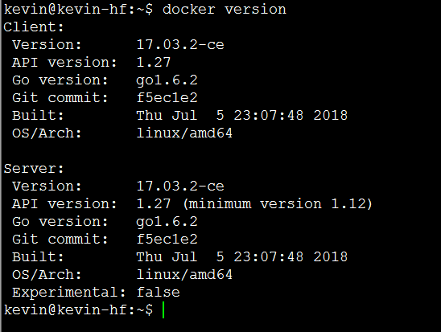

### 1.3. 安装docker-compose

**docker-compose 1.8或更高版本是必需的。**

我们目前无法一次性轻松管理多个容器。 为了解决这个问题，需要**docker-compose** 。

```shell
$ docker-compose version 
$ sudo apt install docker-compose
```

安装完成后查询：

```shell
$ docker-compose version 
```

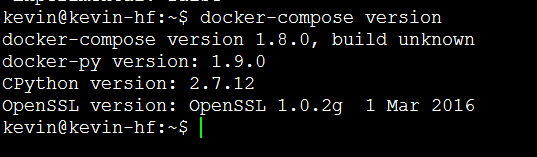

将当前用户添加到 docker 组

```shell
$ sudo usermod -aG docker kevin
```

添加成功后**必须注销/退出并重新登录**(退出终端重新连接即可)

> 如果没有将当前用户添加到 docker 组中，在后期执行make命令时会造成错误: `ERROR: Couldn't connect to Docker daemon at http+docker://localunixsocket - is it running?`

### 1.4. 安装Golang

**需要版本1.10.x或更高。**如果您使用的是 Hyperledger Fabric 1.1.x 版本，那么 Golang 版本在 1.9.x 以上

```shell
 $ go version 
 $ wget https://dl.google.com/go/go1.10.3.linux-amd64.tar.gz
```

> 下载受网络环境影响，如果您本地有相应的 tar 包，则直接解压到指定的路径下即可。

使用 tar 命令将下载后的压缩包文件解压到指定的 /usr/local/ 路径下

```shell
$ sudo tar -zxvf go1.10.3.linux-amd64.tar.gz -C /usr/local/
```

设置GOPATH & GOROOT环境变量, 通过 `go env` 查看GOPATH路径

```shell
$ sudo vim /etc/profile
```

> 如果只想让当前登录用户使用Golang， 其它用户不能使用， 则编辑当前用户$HOME目录下的   .bashrc 或  .profile 文件， 在该文件中添加相应的环境变量即可。

在profile文件最后添加如下内容:

```shell
export GOPATH=$HOME/go
export GOROOT=/usr/local/go
export PATH=$GOROOT/bin:$PATH
```

使用 source 命令，使刚刚添加的配置信息生效：

```shell
$ source /etc/profile
```

通过 go version命令验证是否成功：

```shell
$ go version
```

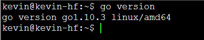

## 2. 网络环境

### 2.1. 网络环境准备

Hyperledger Fabric 处理交易时需要大量的证书来确保在整个端到端流程（TSL，身份验证，签名块......）期间进行加密。 为了直接了解问题的核心，我们已经在 github 上为您的网络环境准备了所有相关的内容， 不在此教程中讲解。

- Crypto 材料已使用 Hyperledger Fabric 中的 **cryptogen** 工具生成，并保存在 hf-fixtures/crypto-config 目录中。有关 **cryptogen** 工具的更多详细信息，请 [点击此处](https://hyperledger-fabric.readthedocs.io/en/latest/commands/cryptogen.html)。
- 初始区块（genesis.block）和通道配置事务（channel.tx）已使用 Hyperledger Fabric中 的 **configtxgen** 工具生成，并保存在 hf-fixtures/artifacts 目录中。有关 **configtxgen** 工具的更多详细信息，请 [点击此处](https://hyperledger-fabric.readthedocs.io/en/latest/commands/configtxgen.html)。

在`GOPATH`的`src`文件夹中新建一个目录如下：

```shell
$ mkdir -p $GOPATH/src/github.com/kongyixueyuan.com/kongyixueyuan 
$ cd $GOPATH/src/github.com/kongyixueyuan.com/kongyixueyuan
```

使用 `git` 命令克隆 hf-fixtures 目录当前路径

```shell
$ git clone https://github.com/kevin-hf/hf-fixtures.git
```

将 hf-fixtures 文件夹重命名为 fixtures

```shell
$ mv hf-fixtures/ fixtures
```

修改`fixtures`  文件夹的所属关系为当前用户

```shell
$ sudo chown -R kevin:kevin ./fixtures
```

> 提示： kevin 为安装 Ubuntu 16.04 系统时创建的用户

进入 `fixtures` 目录

```shell
$ cd fixtures
```

为了构建区块链网络，使用 `docker` 构建处理不同角色的虚拟计算机。 在这里我们将尽可能保持简单。如果确定您的系统中已经存在相关的所需容器，或可以使用其它方式获取，则无需执行如下命令。否则请将 `fixtures` 目录下的 `pull_images.sh` 文件添加可执行权限后直接执行。

```shell
$ chmod 777 ./pull_images.sh
$ ./pull_images.sh 
```

> 提示：`pull_images.sh` 文件是下载 Fabric 环境所需容器的一个可执行脚本，下载过程需要一段时间（视网速情况而定），请耐心等待。另：请确定您的系统支持虚拟技术。

### 2.2. 配置docker-compose.yml文件

在 `fixtures`  目录下创建一个 `docker-compose.yml`  文件并编辑

```shell
$ vim docker-compose.yml
```

1. 将  `network下的basic`   修改为  `default`

   ```yaml
   version: '2'
   
   networks:
     default:
   
   services:
   ```

2. 编辑  orderer 部分

   ```yaml
     orderer.kevin.kongyixueyuan.com:
       image: hyperledger/fabric-orderer
       container_name: orderer.kevin.kongyixueyuan.com
       environment:
         - ORDERER_GENERAL_LOGLEVEL=debug
         - ORDERER_GENERAL_LISTENADDRESS=0.0.0.0
         - ORDERER_GENERAL_LISTENPORT=7050
         - ORDERER_GENERAL_GENESISPROFILE=kongyixueyuan
         - ORDERER_GENERAL_GENESISMETHOD=file
         - ORDERER_GENERAL_GENESISFILE=/var/hyperledger/orderer/genesis.block
         - ORDERER_GENERAL_LOCALMSPID=kevin.kongyixueyuan.com
         - ORDERER_GENERAL_LOCALMSPDIR=/var/hyperledger/orderer/msp
         - ORDERER_GENERAL_TLS_ENABLED=true
         - ORDERER_GENERAL_TLS_PRIVATEKEY=/var/hyperledger/orderer/tls/server.key
         - ORDERER_GENERAL_TLS_CERTIFICATE=/var/hyperledger/orderer/tls/server.crt
         - ORDERER_GENERAL_TLS_ROOTCAS=[/var/hyperledger/orderer/tls/ca.crt]
       working_dir: /opt/gopath/src/github.com/hyperledger/fabric
       command: orderer
       volumes:
         - ./artifacts/genesis.block:/var/hyperledger/orderer/genesis.block
         - ./crypto-config/ordererOrganizations/kevin.kongyixueyuan.com/orderers/orderer.kevin.kongyixueyuan.com/msp:/var/hyperledger/orderer/msp
         - ./crypto-config/ordererOrganizations/kevin.kongyixueyuan.com/orderers/orderer.kevin.kongyixueyuan.com/tls:/var/hyperledger/orderer/tls
       ports:
         - 7050:7050
       networks:
         default:
           aliases:
             - orderer.kevin.kongyixueyuan.com
   ```

3. 编辑 ca 部分

   ```yaml
     ca.org1.kevin.kongyixueyuan.com:
       image: hyperledger/fabric-ca
       container_name: ca.org1.kevin.kongyixueyuan.com
       environment:
         - FABRIC_CA_HOME=/etc/hyperledger/fabric-ca-server
         - FABRIC_CA_SERVER_CA_NAME=ca.org1.kevin.kongyixueyuan.com
         - FABRIC_CA_SERVER_CA_CERTFILE=/etc/hyperledger/fabric-ca-server-config/ca.org1.kevin.kongyixueyuan.com-cert.pem
         - FABRIC_CA_SERVER_CA_KEYFILE=/etc/hyperledger/fabric-ca-server-config/727e69ed4a01a204cd53bf4a97c2c1cb947419504f82851f6ae563c3c96dea3a_sk
         - FABRIC_CA_SERVER_TLS_ENABLED=true
         - FABRIC_CA_SERVER_TLS_CERTFILE=/etc/hyperledger/fabric-ca-server-config/ca.org1.kevin.kongyixueyuan.com-cert.pem
         - FABRIC_CA_SERVER_TLS_KEYFILE=/etc/hyperledger/fabric-ca-server-config/727e69ed4a01a204cd53bf4a97c2c1cb947419504f82851f6ae563c3c96dea3a_sk
       ports:
         - 7054:7054
       command: sh -c 'fabric-ca-server start -b admin:adminpw -d'
       volumes:
         - ./crypto-config/peerOrganizations/org1.kevin.kongyixueyuan.com/ca/:/etc/hyperledger/fabric-ca-server-config
       networks:
         default:
           aliases:
             - ca.org1.kevin.kongyixueyuan.com
   ```

4. 编辑Peer部分

   1. `peer0.org1.example.com`  内容如下

      ```yaml
        peer0.org1.kevin.kongyixueyuan.com:
          image: hyperledger/fabric-peer
          container_name: peer0.org1.kevin.kongyixueyuan.com
          environment:
            - CORE_VM_ENDPOINT=unix:///host/var/run/docker.sock
            - CORE_VM_DOCKER_ATTACHSTDOUT=true
            - CORE_LOGGING_LEVEL=DEBUG
            - CORE_PEER_NETWORKID=kongyixueyuan
            - CORE_PEER_PROFILE_ENABLED=true
            - CORE_PEER_TLS_ENABLED=true
            - CORE_PEER_TLS_CERT_FILE=/var/hyperledger/tls/server.crt
            - CORE_PEER_TLS_KEY_FILE=/var/hyperledger/tls/server.key
            - CORE_PEER_TLS_ROOTCERT_FILE=/var/hyperledger/tls/ca.crt
            - CORE_PEER_ID=peer0.org1.kevin.kongyixueyuan.com
            - CORE_PEER_ADDRESSAUTODETECT=true
            - CORE_PEER_ADDRESS=peer0.org1.kevin.kongyixueyuan.com:7051
            - CORE_PEER_GOSSIP_EXTERNALENDPOINT=peer0.org1.kevin.kongyixueyuan.com:7051
            - CORE_PEER_GOSSIP_USELEADERELECTION=true
            - CORE_PEER_GOSSIP_ORGLEADER=false
            - CORE_PEER_GOSSIP_SKIPHANDSHAKE=true
            - CORE_PEER_LOCALMSPID=org1.kevin.kongyixueyuan.com
            - CORE_PEER_MSPCONFIGPATH=/var/hyperledger/msp
            - CORE_PEER_TLS_SERVERHOSTOVERRIDE=peer0.org1.kevin.kongyixueyuan.com
          working_dir: /opt/gopath/src/github.com/hyperledger/fabric/peer
          command: peer node start
          volumes:
            - /var/run/:/host/var/run/
            - ./crypto-config/peerOrganizations/org1.kevin.kongyixueyuan.com/peers/peer0.org1.kevin.kongyixueyuan.com/msp:/var/hyperledger/msp
            - ./crypto-config/peerOrganizations/org1.kevin.kongyixueyuan.com/peers/peer0.org1.kevin.kongyixueyuan.com/tls:/var/hyperledger/tls
          ports:
            - 7051:7051
            - 7053:7053
          depends_on:
            - orderer.kevin.kongyixueyuan.com
          networks:
            default:
              aliases:
                - peer0.org1.kevin.kongyixueyuan.com
      ```

   2. peer1.org1.example.com 内容如下

      ```yaml
        peer1.org1.kevin.kongyixueyuan.com:
          image: hyperledger/fabric-peer
          container_name: peer1.org1.kevin.kongyixueyuan.com
          environment:
            - CORE_VM_ENDPOINT=unix:///host/var/run/docker.sock
            - CORE_VM_DOCKER_ATTACHSTDOUT=true
            - CORE_LOGGING_LEVEL=DEBUG
            - CORE_PEER_NETWORKID=kongyixueyuan
            - CORE_PEER_PROFILE_ENABLED=true
            - CORE_PEER_TLS_ENABLED=true
            - CORE_PEER_TLS_CERT_FILE=/var/hyperledger/tls/server.crt
            - CORE_PEER_TLS_KEY_FILE=/var/hyperledger/tls/server.key
            - CORE_PEER_TLS_ROOTCERT_FILE=/var/hyperledger/tls/ca.crt
            - CORE_PEER_ID=peer1.org1.kevin.kongyixueyuan.com
            - CORE_PEER_ADDRESSAUTODETECT=true
            - CORE_PEER_ADDRESS=peer1.org1.kevin.kongyixueyuan.com:7051
            - CORE_PEER_GOSSIP_EXTERNALENDPOINT=peer1.org1.kevin.kongyixueyuan.com:7051
            - CORE_PEER_GOSSIP_USELEADERELECTION=true
            - CORE_PEER_GOSSIP_ORGLEADER=false
            - CORE_PEER_GOSSIP_SKIPHANDSHAKE=true
            - CORE_PEER_LOCALMSPID=org1.kevin.kongyixueyuan.com
            - CORE_PEER_MSPCONFIGPATH=/var/hyperledger/msp
            - CORE_PEER_TLS_SERVERHOSTOVERRIDE=peer1.org1.kevin.kongyixueyuan.com
          working_dir: /opt/gopath/src/github.com/hyperledger/fabric/peer
          command: peer node start
          volumes:
            - /var/run/:/host/var/run/
            - ./crypto-config/peerOrganizations/org1.kevin.kongyixueyuan.com/peers/peer1.org1.kevin.kongyixueyuan.com/msp:/var/hyperledger/msp
            - ./crypto-config/peerOrganizations/org1.kevin.kongyixueyuan.com/peers/peer1.org1.kevin.kongyixueyuan.com/tls:/var/hyperledger/tls
          ports:
            - 7151:7051
            - 7153:7053
          depends_on:
            - orderer.kevin.kongyixueyuan.com
          networks:
            default:
              aliases:
                - peer1.org1.kevin.kongyixueyuan.com
      ```

5. 其余可根据实际情况进行添加


### 2.3. 测试网络环境

为了检查网络是否正常工作，使用`docker-compose`同时启动或停止所有容器。 进入`fixtures`文件夹，运行：

```shell
$ cd $GOPATH/src/github.com/kongyixueyuan.com/kongyixueyuan/fixtures
$ docker-compose up
```

如果在您的系统中没有相关的容器，那么会自动下载docker镜像。下载完毕后自动启动，控制台会输出很多不同颜色的日志（红色不等于错误）

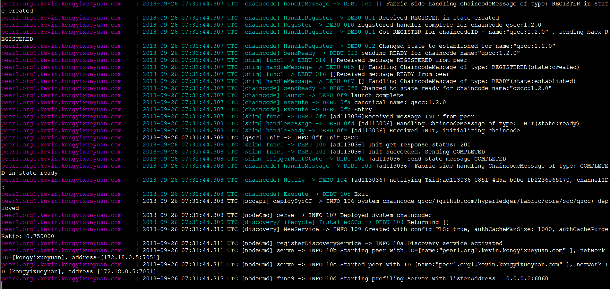

打开一个新终端并运行：

```shell
 $ docker ps 
```

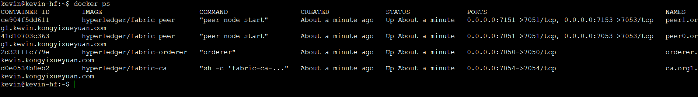

将看到：两个peer，一个orderer和一个CA容器。 代表已成功创建了一个新的网络，可以随SDK一起使用。 要停止网络，请返回到上一个终端，按`Ctrl+C`并等待所有容器都停止。 

> **提示** ：当网络成功启动后，所有处于活动中的容器都可以访问。 也可以查看指定容器的详细日志内容。  如果想删除这些容器，需要使用`docker rm $(docker ps -aq)`将其删除 ，但在删除容器之前需要确定其在网络环境中已不再使用。
>
> 如果在网络环境启动过程中不想看到大量的日志信息，请在该启动命令中添加参数 `-d` ，如下所示： `docker-compose up -d` 。 如果要停止网络，请务必在 `docker-compose.yaml` 所在的文件夹中运行命令： `docker-compose stop` （或 使用`docker-compose down` 进行清理停止所有容器）。

最后在终端2中执行如下命令关闭网络：

```shell
$ cd $GOPATH/src/github.com/kongyixueyuan.com/kongyixueyuan/fixtures
$ docker-compose down
```

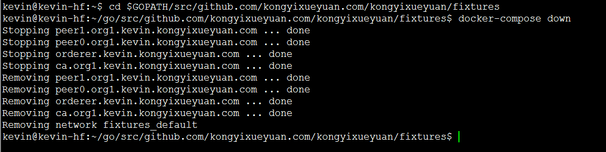


终端1窗口中输出如下：

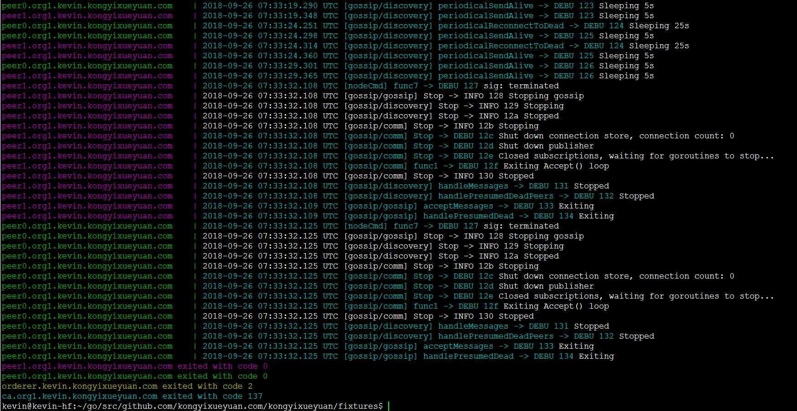


Hyperledger Fabric 提供了许多 SDK 来支持各种不同的编程语言，但是因为 Hyperledger Fabric 是使用 Golang 构建的，所以我们将使用 Go 语言来设计我们的应用程序，包括链码（智能合约）。如果您想使用其它 SDK，如 Fabric-SDK-Java，Fabric-SDK-Node等等，这些都可以通过在线文档进行学习，我们不在这里讨论。

## 3. 配置Fabric-SDK

### 3.1. 创建config.yaml

确认 Hyperledger Fabric 基础网络环境运行没有问题后，现在我们通过创建一个新的 config.yaml 配置文件给应用程序所使用的 Fabric-SDK-Go 配置相关参数及 Fabric 组件的通信地址

进入项目的根目录中创建一个 `config.yaml` 文件并编辑

```shell
$ cd $GOPATH/src/github.com/kongyixueyuan.com/kongyixueyuan
$ vim config.yaml
```

config.yaml 文件完整内容如下:

```yaml
name: "kongyixueyuan-network"
#
# Schema version of the content. Used by the SDK to apply the corresponding parsing rules.
#
version: 1.0.0

#
# The client section used by GO SDK.
#
client:

  # Which organization does this application instance belong to? The value must be the name of an org
  # defined under "organizations"
  organization: Org1

  logging:
    level: info

  # Global configuration for peer, event service and orderer timeouts
  # if this this section is omitted, then default values will be used (same values as below)
#  peer:
#    timeout:
#      connection: 10s
#      response: 180s
#      discovery:
#        # Expiry period for discovery service greylist filter
#        # The channel client will greylist peers that are found to be offline
#        # to prevent re-selecting them in subsequent retries.
#        # This interval will define how long a peer is greylisted
#        greylistExpiry: 10s
#  eventService:
#    # Event service type (optional). If not specified then the type is automatically
#    # determined from channel capabilities.
#    type: (deliver|eventhub)
    # the below timeouts are commented out to use the default values that are found in
    # "pkg/fab/endpointconfig.go"
    # the client is free to override the default values by uncommenting and resetting
    # the values as they see fit in their config file
#    timeout:
#      connection: 15s
#      registrationResponse: 15s
#  orderer:
#    timeout:
#      connection: 15s
#      response: 15s
#  global:
#    timeout:
#      query: 180s
#      execute: 180s
#      resmgmt: 180s
#    cache:
#      connectionIdle: 30s
#      eventServiceIdle: 2m
#      channelConfig: 30m
#      channelMembership: 30s
#      discovery: 10s
#      selection: 10m

  # Root of the MSP directories with keys and certs.
  cryptoconfig:
    path: ${GOPATH}/src/github.com/kongyixueyuan.com/kongyixueyuan/fixtures/crypto-config

  # Some SDKs support pluggable KV stores, the properties under "credentialStore"
  # are implementation specific
  credentialStore:
    path: /tmp/kongyixueyuan-store

    # [Optional]. Specific to the CryptoSuite implementation used by GO SDK. Software-based implementations
    # requiring a key store. PKCS#11 based implementations does not.
    cryptoStore:
      path: /tmp/kongyixueyuan-msp

   # BCCSP config for the client. Used by GO SDK.
  BCCSP:
    security:
     enabled: true
     default:
      provider: "SW"
     hashAlgorithm: "SHA2"
     softVerify: true
     level: 256

  tlsCerts:
    # [Optional]. Use system certificate pool when connecting to peers, orderers (for negotiating TLS) Default: false
    systemCertPool: false

    # [Optional]. Client key and cert for TLS handshake with peers and orderers
    client:
      key:
        path:
      cert:
        path:

#
# [Optional]. But most apps would have this section so that channel objects can be constructed
# based on the content below. If an app is creating channels, then it likely will not need this
# section.
#
channels:
  # name of the channel
  kevinkongyixueyuan:
    # Required. list of orderers designated by the application to use for transactions on this
    # channel. This list can be a result of access control ("org1" can only access "ordererA"), or
    # operational decisions to share loads from applications among the orderers.  The values must
    # be "names" of orgs defined under "organizations/peers"
    # deprecated: not recommended, to override any orderer configuration items, entity matchers should be used.
    # orderers:
    #  - orderer.kevin.kongyixueyuan.com

    # Required. list of peers from participating orgs
    peers:
      peer0.org1.kevin.kongyixueyuan.com:
        # [Optional]. will this peer be sent transaction proposals for endorsement? The peer must
        # have the chaincode installed. The app can also use this property to decide which peers
        # to send the chaincode install request. Default: true
        endorsingPeer: true

        # [Optional]. will this peer be sent query proposals? The peer must have the chaincode
        # installed. The app can also use this property to decide which peers to send the
        # chaincode install request. Default: true
        chaincodeQuery: true

        # [Optional]. will this peer be sent query proposals that do not require chaincodes, like
        # queryBlock(), queryTransaction(), etc. Default: true
        ledgerQuery: true

        # [Optional]. will this peer be the target of the SDK's listener registration? All peers can
        # produce events but the app typically only needs to connect to one to listen to events.
        # Default: true
        eventSource: true

      peer1.org1.kevin.kongyixueyuan.com:
        endorsingPeer: true
        chaincodeQuery: true
        ledgerQuery: true
        eventSource: true

    policies:
      #[Optional] options for retrieving channel configuration blocks
      queryChannelConfig:
        #[Optional] min number of success responses (from targets/peers)
        minResponses: 1
        #[Optional] channel config will be retrieved for these number of random targets
        maxTargets: 1
        #[Optional] retry options for query config block
        retryOpts:
          #[Optional] number of retry attempts
          attempts: 5
          #[Optional] the back off interval for the first retry attempt
          initialBackoff: 500ms
          #[Optional] the maximum back off interval for any retry attempt
          maxBackoff: 5s
          #[Optional] he factor by which the initial back off period is exponentially incremented
          backoffFactor: 2.0
      #[Optional] options for retrieving discovery info
      discovery:
        #[Optional] discovery info will be retrieved for these number of random targets
        maxTargets: 2
        #[Optional] retry options for retrieving discovery info
        retryOpts:
          #[Optional] number of retry attempts
          attempts: 4
          #[Optional] the back off interval for the first retry attempt
          initialBackoff: 500ms
          #[Optional] the maximum back off interval for any retry attempt
          maxBackoff: 5s
          #[Optional] he factor by which the initial back off period is exponentially incremented
          backoffFactor: 2.0
      #[Optional] options for the event service
      eventService:
        # [Optional] resolverStrategy specifies the peer resolver strategy to use when connecting to a peer
        # Possible values: [PreferOrg (default), MinBlockHeight, Balanced]
        #
        # PreferOrg:
        #   Determines which peers are suitable based on block height lag threshold, although will prefer the peers in the
        #   current org (as long as their block height is above a configured threshold). If none of the peers from the current org
        #   are suitable then a peer from another org is chosen.
        # MinBlockHeight:
        #   Chooses the best peer according to a block height lag threshold. The maximum block height of all peers is
        #   determined and the peers whose block heights are under the maximum height but above a provided "lag" threshold are load
        #   balanced. The other peers are not considered.
        # Balanced:
        #   Chooses peers using the configured balancer.
        resolverStrategy: PreferOrg
        # [Optional] balancer is the balancer to use when choosing a peer to connect to
        # Possible values: [Random (default), RoundRobin]
        balancer: Random
        # [Optional] blockHeightLagThreshold sets the block height lag threshold. This value is used for choosing a peer
        # to connect to. If a peer is lagging behind the most up-to-date peer by more than the given number of
        # blocks then it will be excluded from selection.
        # If set to 0 then only the most up-to-date peers are considered.
        # If set to -1 then all peers (regardless of block height) are considered for selection.
        # Default: 5
        blockHeightLagThreshold: 5
        # [Optional] reconnectBlockHeightLagThreshold - if >0 then the event client will disconnect from the peer if the peer's
        # block height falls behind the specified number of blocks and will reconnect to a better performing peer.
        # If set to 0 then this feature is disabled.
        # Default: 10
        # NOTES:
        #   - peerMonitorPeriod must be >0 to enable this feature
        #   - Setting this value too low may cause the event client to disconnect/reconnect too frequently, thereby
        #     affecting performance.
        reconnectBlockHeightLagThreshold: 10
        # [Optional] peerMonitorPeriod is the period in which the connected peer is monitored to see if
        # the event client should disconnect from it and reconnect to another peer.
        # Default: 0 (disabled)
        peerMonitorPeriod: 5s

#
# list of participating organizations in this network
#
organizations:
  Org1:
    mspid: org1.kevin.kongyixueyuan.com
    cryptoPath: peerOrganizations/org1.kevin.kongyixueyuan.com/users/{userName}@org1.kevin.kongyixueyuan.com/msp
    peers:
      - peer0.org1.kevin.kongyixueyuan.com
      - peer1.org1.kevin.kongyixueyuan.com

    # [Optional]. Certificate Authorities issue certificates for identification purposes in a Fabric based
    # network. Typically certificates provisioning is done in a separate process outside of the
    # runtime network. Fabric-CA is a special certificate authority that provides a REST APIs for
    # dynamic certificate management (enroll, revoke, re-enroll). The following section is only for
    # Fabric-CA servers.
    certificateAuthorities:
      - ca.org1.kevin.kongyixueyuan.com

#
# List of orderers to send transaction and channel create/update requests to. For the time
# being only one orderer is needed. If more than one is defined, which one get used by the
# SDK is implementation specific. Consult each SDK's documentation for its handling of orderers.
#
orderers:
  orderer.kevin.kongyixueyuan.com:
    url: localhost:7050

    # these are standard properties defined by the gRPC library
    # they will be passed in as-is to gRPC client constructor
    grpcOptions:
      ssl-target-name-override: orderer.kevin.kongyixueyuan.com
      # These parameters should be set in coordination with the keepalive policy on the server,
      # as incompatible settings can result in closing of connection.
      # When duration of the 'keep-alive-time' is set to 0 or less the keep alive client parameters are disabled
      keep-alive-time: 0s
      keep-alive-timeout: 20s
      keep-alive-permit: false
      fail-fast: false
      # allow-insecure will be taken into consideration if address has no protocol defined, if true then grpc or else grpcs
      allow-insecure: false

    tlsCACerts:
      # Certificate location absolute path
      path: ${GOPATH}/src/github.com/kongyixueyuan.com/kongyixueyuan/fixtures/crypto-config/ordererOrganizations/kevin.kongyixueyuan.com/tlsca/tlsca.kevin.kongyixueyuan.com-cert.pem

#
# List of peers to send various requests to, including endorsement, query
# and event listener registration.
#
peers:
  peer0.org1.kevin.kongyixueyuan.com:
    # this URL is used to send endorsement and query requests
    url: localhost:7051
    # eventUrl is only needed when using eventhub (default is delivery service)
    eventUrl: localhost:7053

    grpcOptions:
      ssl-target-name-override: peer0.org1.kevin.kongyixueyuan.com
      # These parameters should be set in coordination with the keepalive policy on the server,
      # as incompatible settings can result in closing of connection.
      # When duration of the 'keep-alive-time' is set to 0 or less the keep alive client parameters are disabled
      keep-alive-time: 0s
      keep-alive-timeout: 20s
      keep-alive-permit: false
      fail-fast: false
      # allow-insecure will be taken into consideration if address has no protocol defined, if true then grpc or else grpcs
      allow-insecure: false

    tlsCACerts:
      # Certificate location absolute path
      path: ${GOPATH}/src/github.com/kongyixueyuan.com/kongyixueyuan/fixtures/crypto-config/peerOrganizations/org1.kevin.kongyixueyuan.com/tlsca/tlsca.org1.kevin.kongyixueyuan.com-cert.pem

  peer1.org1.kevin.kongyixueyuan.com:
    # this URL is used to send endorsement and query requests
    url: localhost:7151
    # eventUrl is only needed when using eventhub (default is delivery service)
    eventUrl: localhost:7153

    grpcOptions:
      ssl-target-name-override: peer1.org1.kevin.kongyixueyuan.com
      # These parameters should be set in coordination with the keepalive policy on the server,
      # as incompatible settings can result in closing of connection.
      # When duration of the 'keep-alive-time' is set to 0 or less the keep alive client parameters are disabled
      keep-alive-time: 0s
      keep-alive-timeout: 20s
      keep-alive-permit: false
      fail-fast: false
      # allow-insecure will be taken into consideration if address has no protocol defined, if true then grpc or else grpcs
      allow-insecure: false

    tlsCACerts:
      # Certificate location absolute path
      path: ${GOPATH}/src/github.com/kongyixueyuan.com/kongyixueyuan/fixtures/crypto-config/peerOrganizations/org1.kevin.kongyixueyuan.com/tlsca/tlsca.org1.kevin.kongyixueyuan.com-cert.pem

#
# Fabric-CA is a special kind of Certificate Authority provided by Hyperledger Fabric which allows
# certificate management to be done via REST APIs. Application may choose to use a standard
# Certificate Authority instead of Fabric-CA, in which case this section would not be specified.
#
certificateAuthorities:
  ca.org1.kevin.kongyixueyuan.com:
    url: http://localhost:7054
    tlsCACerts:
      # Certificate location absolute path
      path: ${GOPATH}/src/github.com/kongyixueyuan.com/kongyixueyuan/fixtures/crypto-config/peerOrganizations/org1.kevin.kongyixueyuan.com/ca/ca.org1.kevin.kongyixueyuan.com-cert.pem

    # Fabric-CA supports dynamic user enrollment via REST APIs. A "root" user, a.k.a registrar, is
    # needed to enroll and invoke new users.
    registrar:
      enrollId: admin
      enrollSecret: adminpw
    # [Optional] The optional name of the CA.
    caName: ca.org1.kevin.kongyixueyuan.com

entityMatchers:
  peer:
    - pattern: (\w*)peer0.org1.kevin.kongyixueyuan.com(\w*)
      urlSubstitutionExp: localhost:7051
      eventUrlSubstitutionExp: localhost:7053
      sslTargetOverrideUrlSubstitutionExp: peer0.org1.kevin.kongyixueyuan.com
      mappedHost: peer0.org1.kevin.kongyixueyuan.com

    - pattern: (\w*)peer1.org1.kevin.kongyixueyuan.com(\w*)
      urlSubstitutionExp: localhost:7151
      eventUrlSubstitutionExp: localhost:7153
      sslTargetOverrideUrlSubstitutionExp: peer1.org1.kevin.kongyixueyuan.com
      mappedHost: peer1.org1.kevin.kongyixueyuan.com

  orderer:
    - pattern: (\w*)orderer.kevin.kongyixueyuan.com(\w*)
      urlSubstitutionExp: localhost:7050
      sslTargetOverrideUrlSubstitutionExp: orderer.kevin.kongyixueyuan.com
      mappedHost: orderer.kevin.kongyixueyuan.com

  certificateAuthorities:
    - pattern: (\w*)ca.org1.kevin.kongyixueyuan.com(\w*)
      urlSubstitutionExp: http://localhost:7054
      mappedHost: ca.org1.kevin.kongyixueyuan.com
```

### 3.2. 定义所需结构体

配置文件完成指定的配置信息之后，我们开始编写代码。

在项目的根目录下添加一个名为 `sdkInit` 的新目录，我们将在这个文件夹中创建 SDK，并根据配置信息创建应用通道

```shell
$ mkdir sdkInit
```

为了方便管理 Hyperledger Fabric 网络环境，我们将在 `sdkInit` 目录中创建一个 `fabricInitInfo.go`  的源代码文件，用于定义一个结构体，包括 Fabric SDK 所需的各项相关信息

```shell
$ vim sdkInit/fabricInitInfo.go 
```

`fabricInitInfo.go ` 源代码如下：

```go
package sdkInit

import (
	"github.com/hyperledger/fabric-sdk-go/pkg/client/resmgmt"
)

type InitInfo struct {
	ChannelID     string
	ChannelConfig string
	OrgAdmin      string
	OrgName       string
	OrdererOrgName	string
	OrgResMgmt *resmgmt.Client
}

```

### 3.3. 创建SDK

在 `sdkInit` 目录下新创建一个名为 `start.go` 的go文件利用 vim 编辑器进行编辑：

```shell
$ vim sdkInit/start.go 
```

```go
/**
  author: hanxiaodong
 */
package sdkInit

import (
	"github.com/hyperledger/fabric-sdk-go/pkg/fabsdk"
	"github.com/hyperledger/fabric-sdk-go/pkg/core/config"
	"fmt"
	"github.com/hyperledger/fabric-sdk-go/pkg/client/resmgmt"
	mspclient "github.com/hyperledger/fabric-sdk-go/pkg/client/msp"
	"github.com/hyperledger/fabric-sdk-go/pkg/common/providers/msp"
	"github.com/hyperledger/fabric-sdk-go/pkg/common/errors/retry"

)


const ChaincodeVersion  = "1.0"


func SetupSDK(ConfigFile string, initialized bool) (*fabsdk.FabricSDK, error) {

	if initialized {
		return nil, fmt.Errorf("Fabric SDK已被实例化")
	}

	sdk, err := fabsdk.New(config.FromFile(ConfigFile))
	if err != nil {
		return nil, fmt.Errorf("实例化Fabric SDK失败: %v", err)
	}

	fmt.Println("Fabric SDK初始化成功")
	return sdk, nil
}

func CreateChannel(sdk *fabsdk.FabricSDK, info *InitInfo) error {

	clientContext := sdk.Context(fabsdk.WithUser(info.OrgAdmin), fabsdk.WithOrg(info.OrgName))
	if clientContext == nil {
		return fmt.Errorf("根据指定的组织名称与管理员创建资源管理客户端Context失败")
	}

	// New returns a resource management client instance.
	resMgmtClient, err := resmgmt.New(clientContext)
	if err != nil {
		return fmt.Errorf("根据指定的资源管理客户端Context创建通道管理客户端失败: %v", err)
	}

	// New creates a new Client instance
	mspClient, err := mspclient.New(sdk.Context(), mspclient.WithOrg(info.OrgName))
	if err != nil {
		return fmt.Errorf("根据指定的 OrgName 创建 Org MSP 客户端实例失败: %v", err)
	}

	//  Returns: signing identity
	adminIdentity, err := mspClient.GetSigningIdentity(info.OrgAdmin)
	if err != nil {
		return fmt.Errorf("获取指定id的签名标识失败: %v", err)
	}

	// SaveChannelRequest holds parameters for save channel request
	channelReq := resmgmt.SaveChannelRequest{ChannelID:info.ChannelID, ChannelConfigPath:info.ChannelConfig, SigningIdentities:[]msp.SigningIdentity{adminIdentity}}
	// save channel response with transaction ID
	 _, err = resMgmtClient.SaveChannel(channelReq, resmgmt.WithRetry(retry.DefaultResMgmtOpts), resmgmt.WithOrdererEndpoint(info.OrdererOrgName))
	if err != nil {
		return fmt.Errorf("创建应用通道失败: %v", err)
	}

	fmt.Println("通道已成功创建，")

	info.OrgResMgmt = resMgmtClient

	// allows for peers to join existing channel with optional custom options (specific peers, filtered peers). If peer(s) are not specified in options it will default to all peers that belong to client's MSP.
	err = info.OrgResMgmt.JoinChannel(info.ChannelID, resmgmt.WithRetry(retry.DefaultResMgmtOpts), resmgmt.WithOrdererEndpoint(info.OrdererOrgName))
	if err != nil {
		return fmt.Errorf("Peers加入通道失败: %v", err)
	}

	fmt.Println("peers 已成功加入通道.")
	return nil
}
```

在这个阶段，我们只初始化一个客户端，它将与 peer，CA 和 orderer进行通信。 还创建了一个指定的应用通道, 并将 Peer 节点加入到此通道中

### 3.4. 编写测试代码

为了确保客户端能够初始化所有组件，将在启动网络的情况下进行简单的测试。 为了做到这一点，我们需要编写 Go 代码，在项目根目录下新创建一个 `main.go` 的主文件并编辑内容

```shell
$ cd $GOPATH/src/github.com/kongyixueyuan.com/kongyixueyuan
$ vim main.go
```

`main.go` 文件完整源代码如下：

```go
/**
  author: hanxiaodong
 */
package main

import (
	"os"
	"fmt"
	"github.com/kongyixueyuan.com/kongyixueyuan/sdkInit"
)

const (
	configFile = "config.yaml"
	initialized = false
	SimpleCC = "simplecc"
)

func main() {

	initInfo := &sdkInit.InitInfo{

		ChannelID: "kevinkongyixueyuan",
		ChannelConfig: os.Getenv("GOPATH") + "/src/github.com/kongyixueyuan.com/kongyixueyuan/fixtures/artifacts/channel.tx",

		OrgAdmin:"Admin",
		OrgName:"Org1",
		OrdererOrgName: "orderer.kevin.kongyixueyuan.com",

	}

	sdk, err := sdkInit.SetupSDK(configFile, initialized)
	if err != nil {
		fmt.Printf(err.Error())
		return
	}

	defer sdk.Close()

	err = sdkInit.CreateChannel(sdk, initInfo)
	if err != nil {
		fmt.Println(err.Error())
		return
	}

}
```

## 4. 满足依赖

### 4.1. 安装dep工具

在运行应用程序之前，需要将 Go 源代码时行编译，但在开始编译之前，我们需要使用一个 `vendor` 目录来包含应用中所需的所有的依赖关系。 在我们的GOPATH中，我们有Fabric SDK Go和其他项目。 在尝试编译应用程序时，Golang 会在 GOPATH 中搜索依赖项，但首先会检查项目中是否存在`vendor` 文件夹。 如果依赖性得到满足，那么 Golang 就不会去检查 GOPATH 或 GOROOT。 这在使用几个不同版本的依赖关系时非常有用（可能会发生一些冲突，比如在例子中有多个BCCSP定义，通过使用像[`dep`](https://translate.googleusercontent.com/translate_c?depth=1&hl=zh-CN&rurl=translate.google.com&sl=en&sp=nmt4&tl=zh-CN&u=https://github.com/golang/dep&xid=25657,15700002,15700019,15700124,15700149,15700168,15700186,15700201&usg=ALkJrhgelyRl7D3pIJRpuA8cynagkWYHXg)这样的工具在`vendor`目录中来处理这些依赖关系。

将如下环境变量设置到用户的环境文件中(.bashrc)中

```shell
$ vim ~/.bashrc

export PATH=$PATH:$GOPATH/bin
```

执行 `source` 命令

```shell
$ source ~/.bashrc
```

安装 dep 工具

```shell
$ go get -u github.com/golang/dep/cmd/dep
```

### 4.2. 下载所需依赖

`dep` 工具安装好之后我们来安装应用所需要的依赖

使用 `dep` 命令需要一个名为 `Gopkg.toml` 的配置文件指定依赖信息

创建一个名为`Gopkg.toml`的文件并将其复制到里面：

```shell
$ vim Gopkg.toml
```

```toml
ignored = ["github.com/kongyixueyuan.com/kongyixueyuan/chaincode"]

[[constraint]]
  # Release v1.0.0-alpha4
  name = "github.com/hyperledger/fabric-sdk-go"
  revision = "a906355f73d060d7bf95874a9e90dc17589edbb3"

```

使用`dep`限制在 vendor 中指定希望SDK的特定版本。

> 因为在使用SDK执行安装与实例化链码部分时，使用 dep ensure 命令会报依赖错误，所以必须添加 ignored 选项

保存该文件，然后执行 `dep ensure` 命令，该命令会自动将项目所需的依赖下载至当前的 `vendor` 目录中（下载依赖可能需要一段时间）：

```shell
$ dep ensure
```

提醒：`dep ensure` 命令执行由于时间比较长，所以执行一次后即可，在后面的Makefile中可注释`@dep ensure`命令。

### 4.3. 测试Fabric-SDK

所在依赖下载安装完成后，我们就可以进行测试

首先启动网络：

```shell
$ cd fixtures
$ docker-compose up -d
```

然后编译并运行：

```shell
$ cd ..
$ go build
$ ./kongyixueyuan
```

命令执行后输出结果如下图所示：

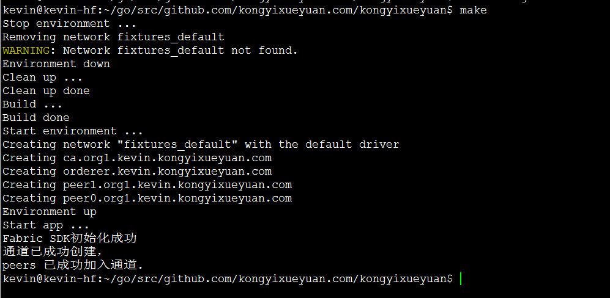

如果出现上图的输出结果，则说明执行成功，否则需要根据出现的错误提示进行相应的处理。


### 4.4. 利用Makefile

Fabric SDK生成一些文件，如证书，二进制文件和临时文件。 关闭网络不会完全清理环境，当需要重新启动时，这些文件将被使用以避免重复的构建过程。 对于开发，可以快速测试，但对于真正的测试环境，需要清理所有内容并从头开始。

*如何清理环境*

- 关闭你的网络： 

  ```shell
  $ cd $GOPATH/src/github.com/kongyixueyuan.com/kongyixueyuan/fixtures 
  $ docker-compose down
  ```

- 删除证书存储（在配置文件中，`client.credentialStore`中定义）：

  ```shell
  $ rm -rf /tmp/kongyixueyuan-*
  ```

- 删除一些不是由`docker-compose`命令生成的docker容器和docker镜像： 

  ```shell
  $ docker rm -f -v `docker ps -a --no-trunc | grep "kongyixueyuan" | cut -d ' ' -f 1` 2>/dev/null
  和 
  $ docker rmi `docker images --no-trunc | grep "kongyixueyuan" | cut -d ' ' -f 1` 2>/dev/null
  ```

*如何更有效率？*

可以使用一个命令在一个步骤中自动完成所有的这些任务。 构建和启动过程也可以设置自动化。 为此，将创建一个`Makefile` 文件。 首先，确保您的系统中在  `make` 工具：

```shell
$ make --version
```

> 如果没有 `make` 工具（Ubuntu），则需要先安装 `make` ：
>
> ```shell
> $ sudo apt install make 
> ```

然后使用以下内容在项目的根目录下创建一个名为`Makefile`的文件并进行编辑：

```shell
$ cd $GOPATH/src/github.com/kongyixueyuan.com/kongyixueyuan
$ vim Makefile
```

`Makefile` 文件完整内容如下：

```makefile
.PHONY: all dev clean build env-up env-down run

all: clean build env-up run

dev: build run

##### BUILD
build:
	@echo "Build ..."
	@dep ensure
	@go build
	@echo "Build done"

##### ENV
env-up:
	@echo "Start environment ..."
	@cd fixtures && docker-compose up --force-recreate -d
	@echo "Environment up"

env-down:
	@echo "Stop environment ..."
	@cd fixtures && docker-compose down
	@echo "Environment down"

##### RUN
run:
	@echo "Start app ..."
	@./kongyixueyuan

##### CLEAN
clean: env-down
	@echo "Clean up ..."
	@rm -rf /tmp/kongyixueyuan-* kongyixueyuan
	@docker rm -f -v `docker ps -a --no-trunc | grep "kongyixueyuan" | cut -d ' ' -f 1` 2>/dev/null || true
	@docker rmi `docker images --no-trunc | grep "kongyixueyuan" | cut -d ' ' -f 1` 2>/dev/null || true
	@echo "Clean up done"

```

现在完成任务：

1. 整个环境将被清理干净，
2. go程序将被编译，
3. 之后将部署网络
4. 最后该应用程序将启动并运行。

要使用它，请进入项目的根目录并使用`make`命令：

- 任务`all` ： `make`或`make all`
- 任务`clean` ：清理一切并释放网络（ `make clean` ）
- 任务`build` ：只需构建应用程序（ `make build` ）
- 任务`env-up` ：只需建立网络（ `make env-up` ）
- ...


## 5. 链码开发

为了便于测试及简化代码，我们实现一个简单的链码功能，能够实现对分类账本中的数据进行设置（PutState（k，v））及相应的查询（GetState（k））功能即可。

### 5.1. 编写链码

创建一个存放链码文件的 `chaincode` 目录，然后在该目录下创建一个 `main.go` 的文件并对其进行编辑

```shell
$ mkdir chaincode
$ vim chaincode/main.go
```

`main.go` 文件内容如下：

```go
/**
  author: hanxiaodong
 */
package main

import (
	"github.com/hyperledger/fabric/core/chaincode/shim"
	"github.com/hyperledger/fabric/protos/peer"
	"fmt"
)

type SimpleChaincode struct {

} 

func (t *SimpleChaincode) Init(stub shim.ChaincodeStubInterface) peer.Response{

	return shim.Success(nil)
}

func (t *SimpleChaincode) Invoke(stub shim.ChaincodeStubInterface) peer.Response{
	fun, args := stub.GetFunctionAndParameters()

	var result string
	var err error
	if fun == "set"{
		result, err = set(stub, args)
	}else{
		result, err = get(stub, args)
	}
	if err != nil{
		return shim.Error(err.Error())
	}
	return shim.Success([]byte(result))
}

func set(stub shim.ChaincodeStubInterface, args []string)(string, error){

	if len(args) != 3{
		return "", fmt.Errorf("给定的参数错误")
	}

	err := stub.PutState(args[0], []byte(args[1]))
	if err != nil{
		return "", fmt.Errorf(err.Error())
	}

	err = stub.SetEvent(args[2], []byte{})
	if err != nil {
		return "", fmt.Errorf(err.Error())
	}

	return string(args[0]), nil

}

func get(stub shim.ChaincodeStubInterface, args []string)(string, error){
	if len(args) != 1{
		return "", fmt.Errorf("给定的参数错误")
	}
	result, err := stub.GetState(args[0])
	if err != nil{
		return "", fmt.Errorf("获取数据发生错误")
	}
	if result == nil{
		return "", fmt.Errorf("根据 %s 没有获取到相应的数据", args[0])
	}
	return string(result), nil

}

func main(){
	err := shim.Start(new(SimpleChaincode))
	if err != nil{
		fmt.Printf("启动SimpleChaincode时发生错误: %s", err)
	}
}

```

链码编写好以后，我们需要使用 Fabric-SDK-Go 提供的相关 API 来实现对链码的安装及实例化操作，而无需在命令提示符中输入烦锁的相关操作命令。

## 6. 链码安装及实例化

### 6.1. 声明结构体

新建一个结构体，声明在 `sdkInit/fabricInitInfo.go` 文件中

```shell
$ vim sdkInit/fabricInitInfo.go
```

`fabricInitInfo.go` 文件完整内容如下：

```go
/**
  author: hanxiaodong
 */
package sdkInit

import (
	"github.com/hyperledger/fabric-sdk-go/pkg/client/resmgmt"
)

type InitInfo struct {
	ChannelID     string
	ChannelConfig string
	OrgAdmin      string
	OrgName       string
	OrdererOrgName	string
	OrgResMgmt *resmgmt.Client

	ChaincodeID	string
	ChaincodeGoPath	string
	ChaincodePath	string
	UserName	string
}
```


### 6.2. 使用Fabric-SDK安装及实例化链码

编辑 `sdkInit/start.go` 文件，利用Fabric-SDK提供的接口，对链码进行安装及实例化

```shell
$ vim sdkInit/start.go
```

在 `start.go` 文件中添加如下内容

```go
import (
    [......]
    
	"github.com/hyperledger/fabric-sdk-go/pkg/fab/ccpackager/gopackager"
	"github.com/hyperledger/fabric-sdk-go/third_party/github.com/hyperledger/fabric/common/cauthdsl"
	"github.com/hyperledger/fabric-sdk-go/pkg/client/channel"
)

// hanxiaodong
// QQ群（专业Fabric交流群）：862733552
func InstallAndInstantiateCC(sdk *fabsdk.FabricSDK, info *InitInfo) (*channel.Client, error) {
	fmt.Println("开始安装链码......")
	// creates new go lang chaincode package
	ccPkg, err := gopackager.NewCCPackage(info.ChaincodePath, info.ChaincodeGoPath)
	if err != nil {
		return nil, fmt.Errorf("创建链码包失败: %v", err)
	}

	// contains install chaincode request parameters
	installCCReq := resmgmt.InstallCCRequest{Name: info.ChaincodeID, Path: info.ChaincodePath, Version: ChaincodeVersion, Package: ccPkg}
	// allows administrators to install chaincode onto the filesystem of a peer
	_, err = info.OrgResMgmt.InstallCC(installCCReq, resmgmt.WithRetry(retry.DefaultResMgmtOpts))
	if err != nil {
		return nil, fmt.Errorf("安装链码失败: %v", err)
	}

	fmt.Println("指定的链码安装成功")
	fmt.Println("开始实例化链码......")

	//  returns a policy that requires one valid
	ccPolicy := cauthdsl.SignedByAnyMember([]string{"org1.kevin.kongyixueyuan.com"})

	instantiateCCReq := resmgmt.InstantiateCCRequest{Name: info.ChaincodeID, Path: info.ChaincodePath, Version: ChaincodeVersion, Args: [][]byte{[]byte("init")}, Policy: ccPolicy}
	// instantiates chaincode with optional custom options (specific peers, filtered peers, timeout). If peer(s) are not specified
	_, err = info.OrgResMgmt.InstantiateCC(info.ChannelID, instantiateCCReq, resmgmt.WithRetry(retry.DefaultResMgmtOpts))
	if err != nil {
		return nil, fmt.Errorf("实例化链码失败: %v", err)
	}

	fmt.Println("链码实例化成功")

	clientChannelContext := sdk.ChannelContext(info.ChannelID, fabsdk.WithUser(info.UserName), fabsdk.WithOrg(info.OrgName))
	// returns a Client instance. Channel client can query chaincode, execute chaincode and register/unregister for chaincode events on specific channel.
	channelClient, err := channel.New(clientChannelContext)
	if err != nil {
		return nil, fmt.Errorf("创建应用通道客户端失败: %v", err)
	}

	fmt.Println("通道客户端创建成功，可以利用此客户端调用链码进行查询或执行事务.")

	return channelClient, nil
}
```

### 6.3. 在main中调用

编辑 `main.go` 文件

```shell
$ vim main.go
```

`main.go` 完整内容如下：

```go
/**
  author: hanxiaodong
 */
package main

import (
	"os"
	"fmt"
	"github.com/kongyixueyuan.com/kongyixueyuan/sdkInit"
)

const (
	configFile = "config.yaml"
	initialized = false
	SimpleCC = "simplecc"
)

func main() {

	initInfo := &sdkInit.InitInfo{

		ChannelID: "kevinkongyixueyuan",
		ChannelConfig: os.Getenv("GOPATH") + "/src/github.com/kongyixueyuan.com/kongyixueyuan/fixtures/artifacts/channel.tx",

		OrgAdmin:"Admin",
		OrgName:"Org1",
		OrdererOrgName: "orderer.kevin.kongyixueyuan.com",

		ChaincodeID: SimpleCC,
		ChaincodeGoPath: os.Getenv("GOPATH"),
		ChaincodePath: "github.com/kongyixueyuan.com/kongyixueyuan/chaincode/",
		UserName:"User1",
	}

	sdk, err := sdkInit.SetupSDK(configFile, initialized)
	if err != nil {
		fmt.Printf(err.Error())
		return
	}

	defer sdk.Close()

	err = sdkInit.CreateChannel(sdk, initInfo)
	if err != nil {
		fmt.Println(err.Error())
		return
	}

	channelClient, err := sdkInit.InstallAndInstantiateCC(sdk, initInfo)
	if err != nil {
		fmt.Println(err.Error())
		return
	}
	fmt.Println(channelClient)

}
```

### 6.4. 测试

执行 `make` 命令

```shell
$ make
```

输出如下：

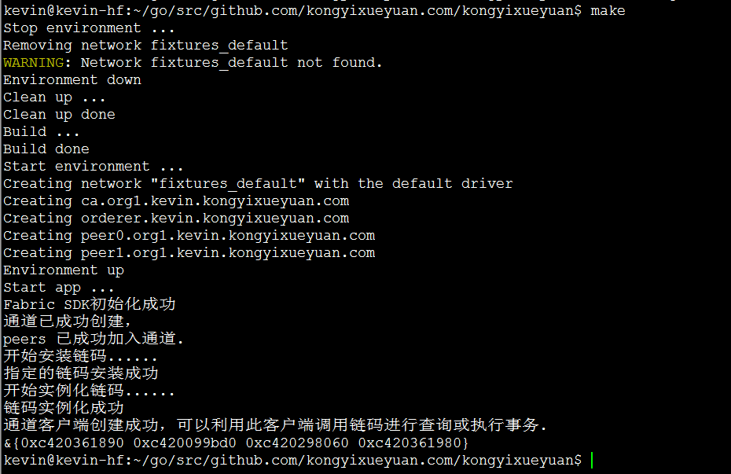


在此，我们已经成功搭建了Fabric的网络环境，并通过 `fabric-sdk-go` 创建了应用通道，将peer加入通道，在peer上安装并实例化了链码。那么如何在真正的应用程序中实现链码的调用，对分类账本中的状态进行操作，`fabric-sdk` 不仅提供了相应的强大功能，而且还给开发人员设计提供了相应的API 接口，以方便开发人员随时调用。做为开发设计人员，我们不仅要考虑用户操作的方便性及可交互性，还需要考虑应用程序后期的可扩展性及维护性，为此我们将为应用增加一个业务层，所有的客户请求都由业务层发送给链码，通过对链码的调用，进而实现对分类账本状态的操作。

## 7. 在业务层调用链码

### 7.1. 事件处理

在项目根目录下创建一个 `service` 目录作为业务层，在业务层中，我们使用 `Fabric-SDK-Go` 提供的接口对象调用相应的 API 以实现对链码的访问，最终实现对分类账本中的状态进行操作。 

```shell
$ cd $GOPATH/src/github.com/kongyixueyuan.com/kongyixueyuan
$ mkdir service
```

在 `service` 目录下创建 `domain.go` 文件并进行编辑， 声明一个结构体及对事件相关而封装的源代码

```shell
$ vim service/domain.go
```

`domain.go` 文件完整内容如下：

```go
/**
  author: hanxiaodong
 */

package service

import (
	"github.com/hyperledger/fabric-sdk-go/pkg/client/channel"
	"fmt"
	"time"
	"github.com/hyperledger/fabric-sdk-go/pkg/common/providers/fab"
)

type ServiceSetup struct {
	ChaincodeID	string
	Client	*channel.Client
}

func regitserEvent(client *channel.Client, chaincodeID, eventID string) (fab.Registration, <-chan *fab.CCEvent) {

	reg, notifier, err := client.RegisterChaincodeEvent(chaincodeID, eventID)
	if err != nil {
		fmt.Println("注册链码事件失败: %s", err)
	}
	return reg, notifier
}

func eventResult(notifier <-chan *fab.CCEvent, eventID string) error {
	select {
	case ccEvent := <-notifier:
		fmt.Printf("接收到链码事件: %v\n", ccEvent)
	case <-time.After(time.Second * 20):
		return fmt.Errorf("不能根据指定的事件ID接收到相应的链码事件(%s)", eventID)
	}
	return nil
}
```

### 7.2. 调用链码添加状态

在 `service` 目录下创建 `SimpleService.go` 文件

```shell
$ vim service/SimpleService.go
```

在 `SimpleService.go` 文件中编写内容如下，通过一个 `SetInfo` 函数实现链码的调用，向分类账本中添加状态的功能：

```go
/**
  author: hanxiaodong
 */
package service

import (
	"github.com/hyperledger/fabric-sdk-go/pkg/client/channel"
)

func (t *ServiceSetup) SetInfo(name, num string) (string, error) {

	eventID := "eventSetInfo"
	reg, notifier := regitserEvent(t.Client, t.ChaincodeID, eventID)
	defer t.Client.UnregisterChaincodeEvent(reg)

	req := channel.Request{ChaincodeID: t.ChaincodeID, Fcn: "set", Args: [][]byte{[]byte(name), []byte(num), []byte(eventID)}}
	respone, err := t.Client.Execute(req)
	if err != nil {
		return "", err
	}

	err = eventResult(notifier, eventID)
	if err != nil {
		return "", err
	}

	return string(respone.TransactionID), nil
}
```

**测试添加状态**

编辑 `main.go` 文件

```shell
$ vim main.go
```

`main.go` 中创建一个对象，并调用 `SetInfo` 函数，内容如下：

```go
/**
  author: hanxiaodong
 */

package main

import (
	[......]
	"github.com/kongyixueyuan.com/kongyixueyuan/service"
)

[......]
	//===========================================//

	serviceSetup := service.ServiceSetup{
		ChaincodeID:SimpleCC,
		Client:channelClient,
	}

	msg, err := serviceSetup.SetInfo("hanxiaodong", "kongyixueyuan")
	if err != nil {
		fmt.Println(err)
	} else {
		fmt.Println(msg)
	}

	//===========================================//

}
```

执行 `make` 命令运行应用程序

```shell
$ make
```

执行后如下图所示：

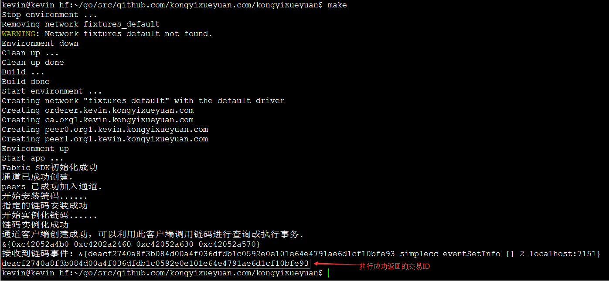


### 7.3. 调用链码查询状态

通过上面的 `setInfo(name, num string)` 函数，实现了向分类账本中添加状态，那么我们还需要实现从该分类账本中根据指定的 key 查询出相应的状态，编辑 `service/SimpleService.go` 文件，向该文件中添加实现查询状态的相应代码。

```shell
$ vim service/SimpleService.go
```

定义一个 `GetInfo` 函数，接收一个字符串类型的参数，该函数实现通过调用链码而查询状态的功能，该函数完整代码如下：

```go
[......]

func (t *ServiceSetup) GetInfo(name string) (string, error){

	req := channel.Request{ChaincodeID: t.ChaincodeID, Fcn: "get", Args: [][]byte{[]byte(name)}}
	respone, err := t.Client.Query(req)
	if err != nil {
		return "", err
	}

	return string(respone.Payload), nil
}
```

**测试查询状态**

编辑 `main.go` 文件

```shell
$ vim main.go
```

在 `main.go` 文件中添加调用代码如下内容：

```go
[......]
	
	msg, err = serviceSetup.GetInfo("hanxiaodong")
	if err != nil {
		fmt.Println(err)
	} else {
		fmt.Println(msg)
	}

	//===========================================//

}
```

执行 `make` 命令运行应用程序

```shell
$ make
```

执行后如下图所示：

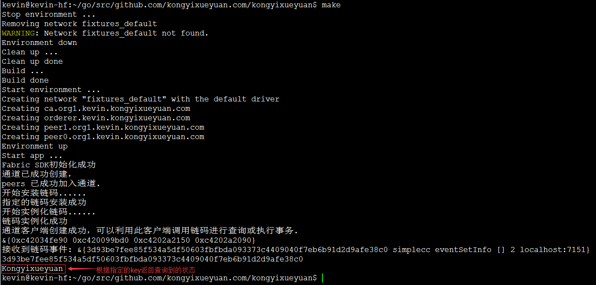


## 8. 实现Web应用

### 8.1. 目录结构

为了让其他用户也可以方便地使用应用程序，最好的选择是开发成为一个Web应用，以便于让用户通过浏览器就可以实现对分类账的操作。同样我们需要考虑应用程序后期的可扩展性及维护性，为此我们将应用程序进行了分层管理，设计增加了控制层及视图层。

视图层提供用户的可视界面与交互，控制层接收用户的请求，由控制层访问业务层，进而调用链码对分类账进行操作，之后将操作结果响应给客户端浏览器。

Go 语言本身提供了一个 Web 服务器来处理 HTTP 请求，并为 HTML 页面提供模板。下面我们来实现 Web 应用程序。

新建web目录，包含三个其他目录的目录。将使用 MVC（Model（模型）－View（视图） - Controller（控制器））模式使其更具可读性及扩展性、维护性。模型将是区块链部分，视图是模板，控制器由`controllers`目录中的功能提供。

- `web/tpl`：包含所有的HTML页面
- `web/static`：包含所有静态CSS，Javascript，图片等文件
- `web/controllers` ：包含将呈现模板的所有函数

```shell
$ cd $GOPATH/src/github.com/kongyixueyuan.com/kongyixueyuan
```

创建相应的目录：

```shell
$ mkdir -p web/controller
$ mkdir -p web/static/css
$ mkdir -p web/static/img
$ mkdir -p web/tpl
```

> 提示：可以直接使用 `git clone https://github.com/kevin-hf/hfsdkgoweb.git` 命令克隆完整的内容到项目的根目录中，然后将文件夹重命名： `mv hfsdkgoweb/ web` ，重新命名后直接跳至 8.6 步骤执行。

**`web/controller`  目录**

 `controller/controllerHandler.go` ： 用于接收并处理各种客户端请求的源代码文件

 `controller/controllerResponse `：用于编写响应客户端请求的源代码文件

**`web/static`目录下包括三个子目录，分别为：**

`web/static/css` ：用于存放页面布局及显示样式所需的 `CSS` 文件

`web/static/js` ：用于存放编写的与用户交互的 `JavaScript` 源码文件

`web/static/img`：用户存放页面显示所需的所有图片文件

**`web/tpl` 目录下包括三个静态 HTML 页面文件，分别为：**

`web/tpl/index.html`： 用户访问的首页面

`web/tpl/queryReq.html`： 用于显示显示查询结果的页面

`web/tpl/setInfo.html`： 用户设置/修改状态的页面

**`web/webServer.go`**：用于指定启动Web服务及相应的路由信息

具体目录结构如下图所示：


### 8.2. 指定响应处理文件

在 `web/controller` 目录下创建 `controllerResponse.go` 文件，用于响应客户端的请求

```shell
$ vim web/controller/controllerResponse.go
```

`controllerResponse.go` 内容参见：

- [web/controller/controllerResponse.go](https://github.com/kevin-hf/hfsdkgoweb/blob/master/controller/controllerResponse.go)

### 8.3. 请求处理控制器

在 `web/controller` 目录下添加 `controllerHandler.go` 文件，用于接收客户端请求并做出相应的处理

```shell
$ vim web/controller/controllerHandler.go
```

`controllerHandler.go` 文件中添加内容参见：

- [web/controller/controllerHandler.go](https://github.com/kevin-hf/hfsdkgoweb/blob/master/controller/controllerHandler.go)

### 8.4. 编写页面

页面详细内容参见：

- [web/tpl/index.html](https://github.com/kevin-hf/hfsdkgoweb/blob/master/tpl/index.html)
- [web/tpl/queryReq.html](https://github.com/kevin-hf/hfsdkgoweb/blob/master/tpl/queryReq.html)
- [web/tpl/setInfo.html](https://github.com/kevin-hf/hfsdkgoweb/blob/master/tpl/setInfo.html)

### 8.5. 添加路由信息

在  `web`  目录中添加  `webServer.go`  文件

```shell
$ vim web/webServer.go
```

编辑  `webServer.go` 文件，内容参见：

- [web/webServer.go](https://github.com/kevin-hf/hfsdkgoweb/blob/master/webServer.go)

### 8.6. 启动Web服务

最后编辑   `main.go` ，以便启动Web界面实现Web应用程序

```shell
$ vim main.go
```

添加如下内容:

```go
import(
	[......]
	"github.com/kongyixueyuan.com/kongyixueyuan/web"
	"github.com/kongyixueyuan.com/kongyixueyuan/web/controller"
)

func main(){}
	[......]
	
	app := controller.Application{
		Fabric: &serviceSetup,
	}
	web.WebStart(&app)
}
```

执行 `make` 命令启动Web应用：

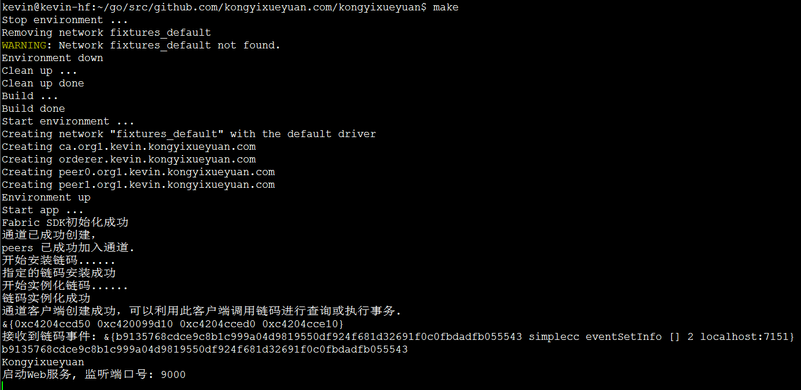

### 8.7. 页面访问

打开浏览器访问:   [htt://localhost:9000/](http://localhost:9000/)

因为我们这是一个简单的 Web 应用示例，所以页面不会要求达到多么美观的地步，只是能够实现相应的功能即可。根据访问的地址，首先进入 `index.html` 页面，该 `index.html` 页面提供了两个链接（也可以通过页面顶部的菜单中访问），用于实现在在分类账本中进行状态查询或对分类账本中的状态进行修改的操作（在此不实现添加状态的操作）。

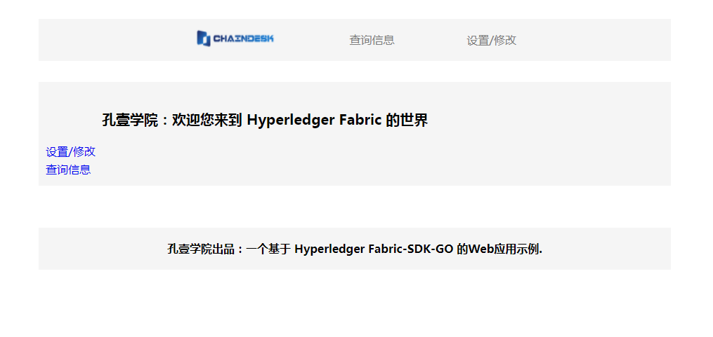

因为我们在业务层中测试过一次，通过调用业务层向分类账中添加了一条状态， 所以现在分类帐中有一个 `key 为 Hanxiaodong `，`value 为 Kongyixueyuan ` 的键值对数据，可以点击 `查询信息` 的链接实现查询

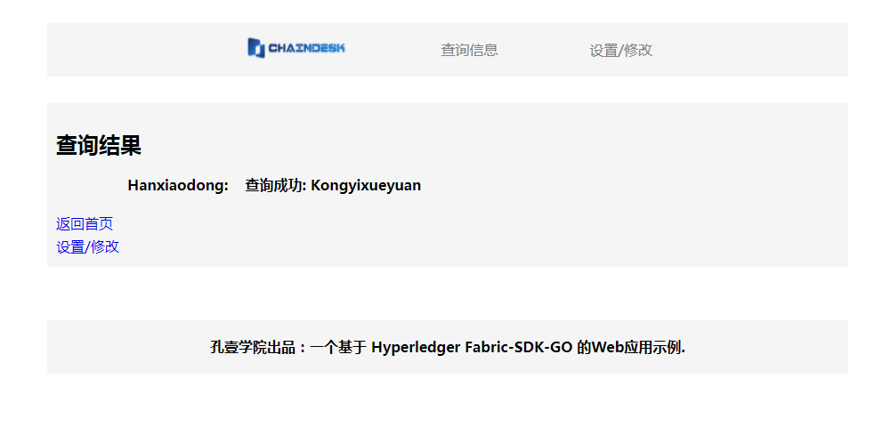

点击页面中的 `设置/修改` 链接后进入一个表单页面，该页面提供了一个更改状态的表单，表单中的 key 为固定值，用户需要输入对应的 Val，之后点击提交按钮发送请求。

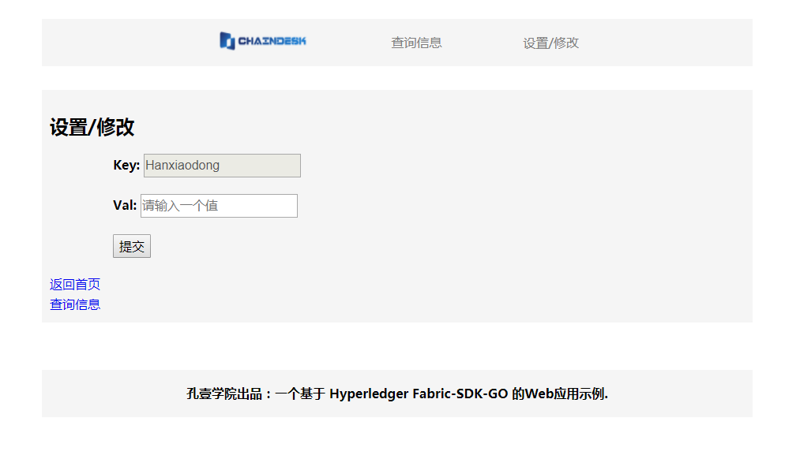

在 Val 输入框中输入一个值，如 `ChainDesk` 后点击提交按钮，表单被提交到服务器，服务器处理完毕将返回操作成功的交易ID并将其显示在页面中。

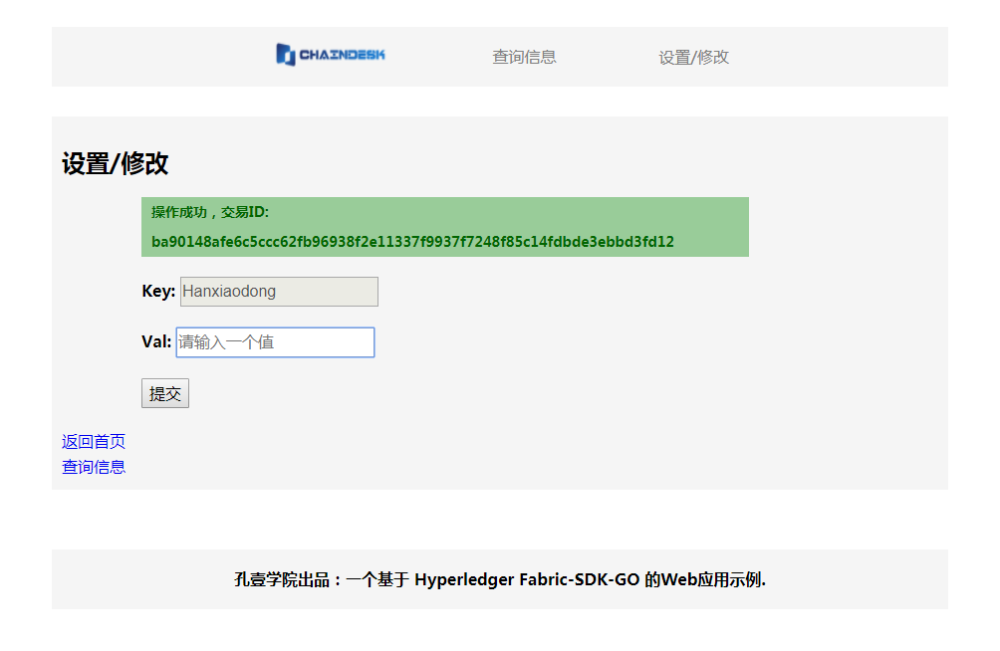

我们可以通过点击页面中的 `查询信息` 链接来查看状态是否更改成功

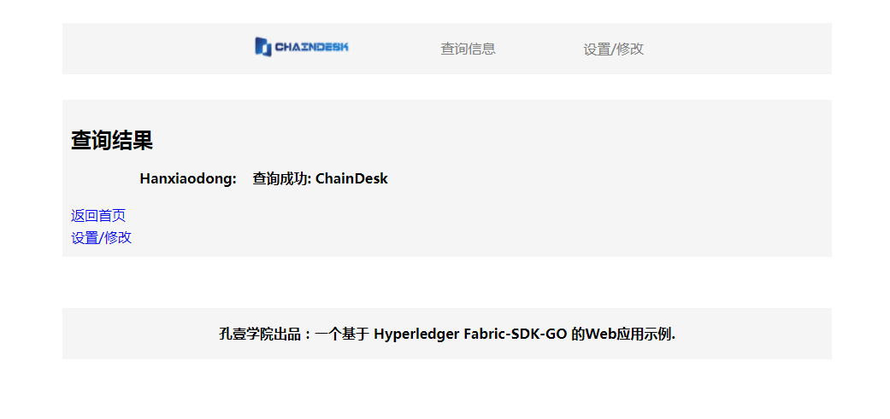

## 9. 参考资料

- [Hyperledger 官网](https://www.hyperledger.org/)
- [Hyperledger Fabric 在线文档](https://hyperledger-fabric.readthedocs.io/en/latest//)
- [Hyperledger Fabric-SDK-Go](https://github.com/hyperledger/fabric-sdk-go)
- [Fabric-SDK-Go tests](https://github.com/hyperledger/fabric-sdk-go/blob/master/test/integration/e2e/end_to_end.go)
- [goweb 编程](https://golang.org/doc/articles/wiki/)
- [web 前端](http://www.w3school.com.cn/)


